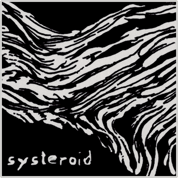

<a href="https://github.com/orhun/systeroid">
    
</a>

#### **`systeroid`** — A more powerful alternative to sysctl.

[`sysctl(8)`](https://man7.org/linux/man-pages/man8/sysctl.8.html) is a utility on Unix-like operating systems that is used to read and modify the attributes of the kernel such as its version number, maximum limits, and security settings[\*](https://en.wikipedia.org/wiki/Sysctl). **systeroid** is "_sysctl on steroids_". It can do everything that sysctl does and even more. It provides a safer, more performant, and user-friendly CLI/TUI for managing the kernel parameters at runtime.

<a href="https://github.com/orhun/systeroid/releases">
    
</a>
<a href="https://crates.io/crates/git-cliff/">
    
</a>
<a href="https://codecov.io/gh/orhun/systeroid">
    
</a>
<br>
<a href="https://github.com/orhun/systeroid/actions?query=workflow%3A%22Continuous+Integration%22">
    
</a>
<a href="https://github.com/orhun/systeroid/actions?query=workflow%3A%22Continuous+Deployment%22">
    
</a>
<a href="https://hub.docker.com/r/orhunp/git-cliff">
    
</a>
<a href="https://docs.rs/git-cliff-core/">
    
</a>
<br>
<br>
<br>

**systeroid** is implemented using [procfs](https://en.wikipedia.org/wiki/Procfs) which is the virtual file system that is typically mapped to a mount point named `/proc` at boot time. This means checking the value of some kernel parameter requires opening a file in this virtual filesystem, reading its contents, parsing them and, closing the file. In Linux, these dynamically configurable kernel options are available under `/proc/sys` which contains directories representing the sections of the kernel and readable/writable virtual files. For example, to enable/disable IP forwarding, `1` or `0` could be written in `/proc/sys/net/ipv4/ip_forward`.

Similarly, systeroid can be used to change the value of a parameter:

```
systeroid ip_forward=1
```

<details>
  <summary>Table of Contents</summary>

- [Resources](#resources)
  - [Logo](#logo)
  - [Social Links](#social-links)
  - [Funding](#funding)
- [Contributing](#contributing)
- [License](#license)
- [Copyright](#copyright)

</details>

## Resources

### Logo

**systeroid** logo was originally painted by [Ryan Tippery](https://www.ryantippery.com/about) as a part of the [Compositions](https://www.ryantippery.com/compositions/) art collection and it is put together by me using the [Filled Spots](https://www.fontspace.com/filled-spots-font-f30755) font. Shout out to Ryan for letting me use his painting for the logo! **<3**

Check out his [store](https://www.ryantippery.com/store) for a fine piece of similar art. Kudos!

### Social Links

* [](https://twitter.com/systeroid)
* [](https://orhun.dev)
  * [](https://github.com/orhun)
  * [](https://twitter.com/orhunp_)

### Funding

If you find **systeroid** and/or other projects on my [GitHub profile](https://github.com/orhun/) useful, consider [becoming a patron](https://www.patreon.com/join/orhunp)!

[](https://patreon.com/join/orhunp)
[](https://patreon.com/join/orhunp)

## Contributing

See our [Contribution Guide](./CONTRIBUTING.md) and please follow the [Code of Conduct](./CODE_OF_CONDUCT.md) in all your interactions with the project.

Unless you explicitly state otherwise, any contribution intentionally submitted for inclusion in the work by you, as defined in the Apache 2.0 License, shall be dual licensed as above, without any additional terms or conditions.

## License

Licensed under either of [Apache License Version 2.0](http://www.apache.org/licenses/LICENSE-2.0) or [The MIT License](http://opensource.org/licenses/MIT) at your option.

## Copyright

Copyright © 2022, [Orhun Parmaksız](mailto:orhunparmaksiz@gmail.com)
