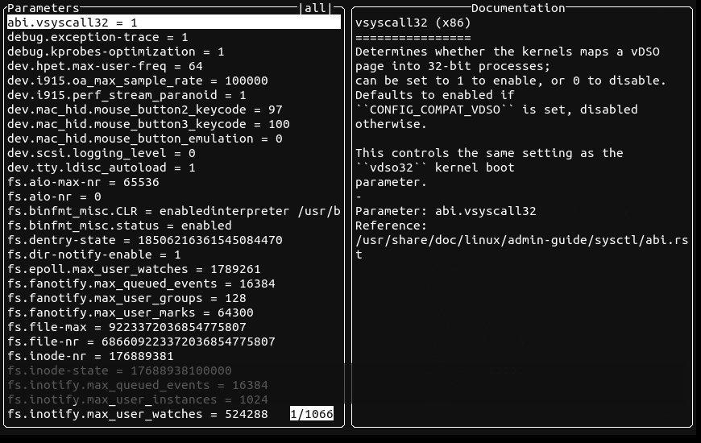
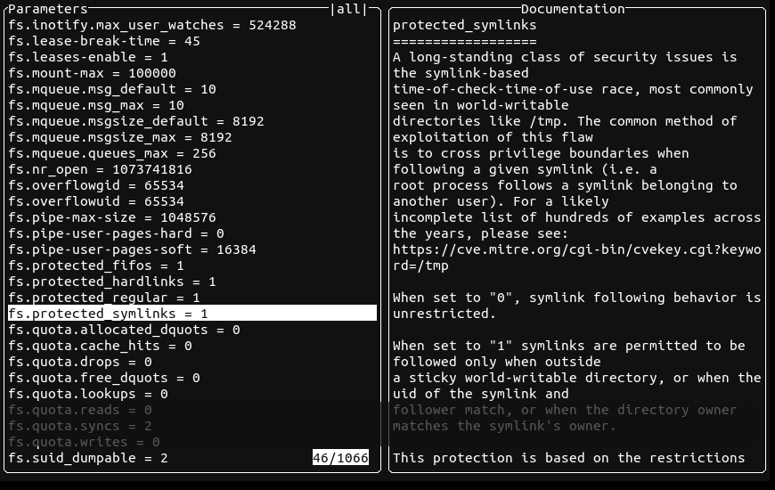
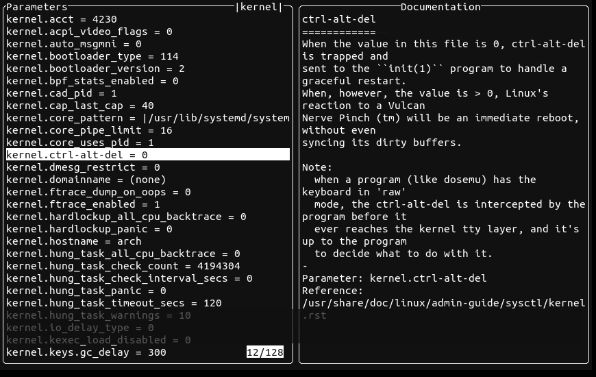
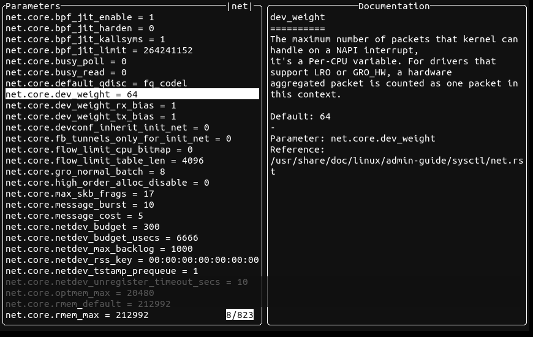

<a href="https://github.com/orhun/systeroid">
    
</a>

#### **`systeroid`** — A more powerful alternative to sysctl(8).

[`sysctl(8)`](https://man7.org/linux/man-pages/man8/sysctl.8.html) is a utility on Unix-like operating systems that is used to read and modify the attributes of the kernel such as its version number, maximum limits, and security settings[\*](https://en.wikipedia.org/wiki/Sysctl). **systeroid** is "_sysctl on steroids_". It can do everything that sysctl does and even more. It provides a safer, more performant, and user-friendly CLI/TUI for managing the kernel parameters at runtime.

<a href="https://github.com/orhun/systeroid/releases">
    
</a>
<a href="https://crates.io/crates/systeroid/">
    
</a>
<a href="https://codecov.io/gh/orhun/systeroid">
    
</a>
<br>
<a href="https://github.com/orhun/systeroid/actions?query=workflow%3A%22Continuous+Integration%22">
    
</a>
<a href="https://github.com/orhun/systeroid/actions?query=workflow%3A%22Continuous+Deployment%22">
    
</a>
<a href="https://hub.docker.com/r/orhunp/systeroid">
    
</a>
<a href="https://docs.rs/systeroid-core/">
    
</a>
<br>
<br>
<br>

**systeroid** is implemented using [procfs](https://en.wikipedia.org/wiki/Procfs) which is the virtual file system that is typically mapped to a mount point named `/proc` at boot time. This means checking the value of some kernel parameter requires opening a file in this virtual filesystem, reading its contents, parsing them, and closing the file. In [Linux](https://en.wikipedia.org/wiki/Linux), these dynamically configurable kernel options are available under `/proc/sys` which contains directories representing the sections of the kernel and readable/writable virtual files. For example, to enable/disable IP forwarding, `1` or `0` could be written in `/proc/sys/net/ipv4/ip_forward` or `systeroid ip_forward=1` command can be used to change the value of the parameter.

<a href="assets/systeroid-demo.gif">
    
</a>

Although **systeroid** does not need the parameter section to be specified explicitly, it is important to know the sections and their areas of impact. Here are the available kernel sections according to the [Linux kernel documentation](https://www.kernel.org/doc/html/latest/admin-guide/sysctl/index.html):

| Section    | Path                | Description                                                   |
| ---------- | ------------------- | ------------------------------------------------------------- |
| **abi**    | `/proc/sys/abi/`    | execution domains & personalities                             |
| **fs**     | `/proc/sys/fs/`     | filesystem settings                                           |
| **kernel** | `/proc/sys/kernel/` | global kernel information / miscellaneous settings            |
| **net**    | `/proc/sys/net/`    | networking settings                                           |
| **sunrpc** | `/proc/sys/sunrpc/` | SUN Remote Procedure Call settings                            |
| **user**   | `/proc/sys/user/`   | user namespace limits                                         |
| **vm**     | `/proc/sys/vm/`     | memory management tuning buffer and cache management settings |
| **dev**    | `/proc/sys/dev/`    | device specific information                                   |
| **debug**  | `/proc/sys/debug/`  | -                                                             |

---

<details>
  <summary>Table of Contents</summary>

- [Requirements](#requirements)
- [Installation](#installation)
  - [Cargo](#cargo)
  - [Arch Linux](#arch-linux)
  - [Binary releases](#binary-releases)
  - [Building from source](#building-from-source)
  - [Docker](#docker)
    - [Images](#images)
    - [Usage](#usage)
    - [Building](#building)
- [Usage](#usage-1)
  - [Options](#options)
  - [Examples](#examples)
    - [Listing parameters](#listing-parameters)
    - [Filtering by section](#filtering-by-section)
    - [Displaying values](#displaying-values)
    - [Setting values](#setting-values)
    - [Loading values from a file](#loading-values-from-a-file)
    - [Loading values from the system directories](#loading-values-from-the-system-directories)
    - [Searching parameters](#searching-parameters)
    - [Showing information about parameters](#showing-information-about-parameters)
- [TUI](#tui)
  - [Usage](#usage-2)
  - [Key Bindings](#key-bindings)
  - [Examples](#examples-1)
    - [Launching](#launching)
    - [Showing help](#showing-help)
    - [Scrolling](#scrolling)
    - [Toggling the kernel section](#toggling-the-kernel-section)
    - [Searching](#searching)
    - [Setting values](#setting-values-1)
    - [Running commands](#running-commands)
    - [Copying to clipboard](#copying-to-clipboard)
    - [Changing the colors](#changing-the-colors)
    - [Viewing the parameter documentation](#viewing-the-parameter-documentation)
    - [Setting the refresh rate](#setting-the-refresh-rate)
- [Resources](#resources)
  - [References](#references)
  - [Logo](#logo)
  - [Social Links](#social-links)
  - [Funding](#funding)
- [Contributing](#contributing)
- [License](#license)
- [Copyright](#copyright)

</details>

## Requirements

- [`Rust`](https://www.rust-lang.org/) (`>=1.56.1`) (see [building from source](#building-from-source))
- [`libxcb`](https://gitlab.freedesktop.org/xorg/lib/libxcb) (for [clipboard support](#copying-to-clipboard))
- [`linux-documentation`](https://www.kernel.org/doc/) (for [viewing the documentation](#viewing-the-parameter-documentation))

To install the runtime dependencies:

- on Arch Linux: `pacman -S libxcb libxkbcommon linux-docs`
- on Debian/Ubuntu: `apt-get install libx11-dev libxcb-shape0-dev libxcb-xfixes0-dev libxkbcommon-dev linux-doc`
- on Fedora: `dnf install libX11-devel kernel-doc`

## Installation

<details>
  <summary>Packaging status</summary>

[](https://repology.org/project/systeroid/versions)

</details>

### Cargo

**systeroid** is available on [crates.io](https://crates.io/crates/systeroid):

```sh
cargo install systeroid
cargo install systeroid-tui
```

### Arch Linux

**systeroid** can be installed from the [community repository](https://archlinux.org/packages/community/x86_64/systeroid/) using [pacman](https://wiki.archlinux.org/title/Pacman):

```sh
pacman -S systeroid
```

### Binary releases

See available [releases](https://github.com/orhun/systeroid/releases) that are automated by [Continuous Deployment](.github/workflows/cd.yml) workflow.

### Building from source

```sh
# clone the repository
git clone https://github.com/orhun/systeroid && cd systeroid/

# binaries will be located at:
# - target/release/systeroid
# - target/release/systeroid-tui
CARGO_TARGET_DIR=target cargo build --release
```

Also see [requirements](#requirements).

### Docker

#### Images

Docker builds are [automated](./.github/workflows/docker.yml) and images are available in the following registries:

- [Docker Hub](https://hub.docker.com/r/orhunp/systeroid)
- [GitHub Container Registry](https://github.com/orhun/systeroid/pkgs/container/systeroid)

#### Usage

The following command can be used to interactively view the documentation of selected parameters:

```sh
docker run --rm -it "orhunp/systeroid:${TAG:-latest}" --tui
```

Docker containers share the host system's kernel and its settings thus access to `/proc` and `/sys` are restricted for security. That is why it is not possible (and not recommended) to tweak the kernel parameters within a container. [\*](https://stackoverflow.com/questions/54845095/cannot-run-sysctl-command-in-dockerfile)

#### Building

Custom Docker images can be built from the [Dockerfile](./Dockerfile):

```sh
docker build -t systeroid .
```

## Usage

```
systeroid [options] [variable[=value] ...] --load[=<file>]
```

### Options

```
-a, --all           display all variables (-A,-X)
-T, --tree          display the variables in a tree-like format
-J, --json          display the variables in JSON format
    --deprecated    include deprecated variables while listing
-e, --ignore        ignore unknown variable errors
-N, --names         print only variable names
-n, --values        print only variable values
-b, --binary        print only variable values without new line
-p, --load          read values from file (-f)
-S, --system        read values from all system directories
-r, --pattern <expr>
                    use a regex for matching variable names
-q, --quiet         do not print variable after the value is set
-w, --write         only enable writing a value to variable
-E, --explain       provide a detailed explanation for variable
-D, --docs <path>   set the path of the kernel documentation
-P, --no-pager      do not pipe output into a pager
-v, --verbose       enable verbose logging
    --tui           show terminal user interface
-h, --help          display this help and exit (-d)
-V, --version       output version information and exit
```

Most of the arguments/flags are inherited from `sysctl` so they have the same functionality.

### Examples

#### Listing parameters

```sh
# list all parameters
systeroid -A

# list parameters in a tree-like format
systeroid -T

# list parameters in JSON format
systeroid -J
```

To disable colors, set the [`NO_COLOR`](https://no-color.org/) environment variable.

#### Filtering by section

```sh
# only list parameters in the "kernel" section
systeroid kernel

# only list parameters in the "vm" and "user" sections
systeroid vm user
```

#### Displaying values

```sh
# print the name and value of a parameter (in "name=value" format)
systeroid kernel.hostname

# print only the value of a parameter
systeroid -n kernel.hostname

# print the name and values of the multiple parameters
systeroid kernel.hostname user.max_user_namespaces
```

#### Setting values

```sh
# set the value of a parameter
systeroid kernel.domainname="example.com"

# set the values of multiple parameters and ignore errors
systeroid -e kernel.dmesg_restrict=0 vm.panic_on_oom=1 unknown_param="test"

# set the values of multiple parameters and enforce the "name=value" format
systeroid -w fs.dir-notify-enable=1 net.mptcp.enabled=1 vm.oom_kill_allocating_task
```

#### Loading values from a file

Parameter values can be set from an [INI file](https://en.wikipedia.org/wiki/INI_file).

`sysctl.conf`:

```ini
# Use kernel.sysrq = 1 to allow all keys.
# See https://www.kernel.org/doc/html/latest/admin-guide/sysrq.html for a list
# of values and keys.
kernel.sysrq = 16

# Append the PID to the core filename
kernel.core_uses_pid = 1

; Enable hard and soft link protection
; (If a line begins with a single '-', any attempts to set the value that fail will be ignored.)
-fs.protected_hardlinks = 1
fs.protected_symlinks = 1
```

To load it:

```sh
systeroid --load sysctl.conf
```

If no file is given, values are loaded from `/etc/sysctl.conf` as default:

```sh
systeroid --load
```

Specifying "-" as file name means reading data from standard input:

```sh
systeroid --load -
```

#### Loading values from the system directories

The list of default system directories are the following:

- `/etc/sysctl.d`
- `/run/sysctl.d`
- `/usr/local/lib/sysctl.d`
- `/usr/lib/sysctl.d`
- `/lib/sysctl.d`
- `/etc/sysctl.conf`

Use `--system` flag to load the files with ".conf" extension in these directories:

```sh
systeroid --system
```

#### Searching parameters

```sh
# search parameters using regex patterns
systeroid -r 'net.ipv4.conf.(eth|wlan)0.arp'
systeroid -r '^net.ipv6'
```

Example output of combining search with listing:

```sh
$ systeroid --names --pattern 'kernel.*_max$' --tree

kernel
├── ngroups_max
├── pid_max
└── sched_util_clamp_max
```

#### Showing information about parameters

**systeroid** can dump the parameter information from the kernel documentation. This is useful if you don't know what a parameter is used for.

```sh
# show information about a parameter
systeroid --explain oom_dump_tasks
```

Kernel documentation should be present in one of the following paths for parsing upon first launch:

- `/usr/share/doc/linux`
- `/usr/share/doc/linux-doc`
- `/usr/share/doc/linux-docs`
- `/usr/share/doc/kernel-doc-*/Documentation`

Then the parsed data is cached in `$HOME/.cache/systeroid-core` and used from there as long as the documentation is not updated. The caching mechanism can be disabled via setting the `NO_CACHE` environment variable.

This is a design choice due to the fact that different versions of kernels might be installed on different systems so the documentation might be too new or old if **systeroid** was to be shipped with a fixed set of parameter descriptions bundled in. With the parsing approach, documentation is always kept up-to-date.

However, this means you need to:

- either install the kernel documentation package (based on your distribution)
  - on Arch Linux: `pacman -S linux-docs`
  - on Debian/Ubuntu: `apt-get install linux-doc`
  - on Fedora: `dnf install kernel-doc`
- or explicitly specify the path of the [kernel documentation](https://git.kernel.org/pub/scm/linux/kernel/git/torvalds/linux.git/tree/Documentation/admin-guide).

```sh
# specify the kernel documentation path explicitly
# (not needed if you have the kernel documentation installed as a package)
systeroid -E user.max_user_namespaces --docs /usr/share/doc/linux
```

To change the default pager (`less(1)`), you can use the `PAGER` environment variable. Also, you can simply use `--no-pager` flag to disable it.

```sh
systeroid -E kernel.ctrl-alt-del --no-pager
```

It is also possible to retrieve information about multiple parameters:

```sh
systeroid -E --pattern '.*ipv4.*' --no-pager
```

## TUI

### Usage

```
systeroid-tui [options]
```

```
-t, --tick-rate <ms>
                    set the tick rate of the terminal [default: 250]
-D, --docs <path>   set the path of the kernel documentation
-s, --section <section>
                    set the section to filter
-q, --query <query> set the query to search
    --bg-color <color>
                    set the background color [default: black]
    --fg-color <color>
                    set the foreground color [default: white]
-n, --no-docs       do not show the kernel documentation
-h, --help          display this help and exit
-V, --version       output version information and exit
```

### Key Bindings

| Key                                                        | Action                       |
| ---------------------------------------------------------- | ---------------------------- |
| <kbd>?</kbd>, <kbd>f1</kbd>                                | show help                    |
| <kbd>up/down</kbd>, <kbd>k/j</kbd>, <kbd>pgup/pgdown</kbd> | scroll list                  |
| <kbd>t/b</kbd>                                             | scroll to top/bottom         |
| <kbd>left/right</kbd>, <kbd>h/l</kbd>                      | scroll documentation         |
| <kbd>tab</kbd>, <kbd>`</kbd>                               | next/previous section        |
| <kbd>:</kbd>                                               | command                      |
| <kbd>/</kbd>, <kbd>s</kbd>                                 | search                       |
| <kbd>enter</kbd>                                           | select / set parameter value |
| <kbd>c</kbd>                                               | copy to clipboard            |
| <kbd>r</kbd>, <kbd>f5</kbd>                                | refresh                      |
| <kbd>esc</kbd>                                             | cancel / exit                |
| <kbd>q</kbd>, <kbd>ctrl-c/ctrl-d</kbd>                     | exit                         |

### Examples

#### Launching

Simply run `systeroid-tui` to launch the terminal user interface. Alternatively, you can use `systeroid --tui` command (which runs `systeroid-tui` under the hood if it is found in [`PATH`](<https://en.wikipedia.org/wiki/PATH_(variable)>)).

#### Showing help

Help menu and key bindings can be shown via pressing <kbd>?</kbd>:


#### Scrolling

Use <kbd>up/down</kbd> keys to scroll the parameter list. Alternatively, use <kbd>t/b</kbd> to scroll to the top/bottom.



Use <kbd>left/right</kbd> to scroll the parameter documentation.



#### Toggling the kernel section

Press <kbd>tab</kbd> or <kbd>`</kbd> to toggle the kernel section for filtering entries in the parameter list.

Order of the sections is `all`-`abi`-`fs`-`kernel`-`net`-`sunrpc`-`user`-`vm`.


`--section` argument can be used to start **systeroid-tui** with the specified section for filtering.

```sh
systeroid-tui --section kernel
```


#### Searching

Press <kbd>/</kbd> and type in your query to search for parameters.


Alternatively, you can start **systeroid-tui** with a pre-defined search query by using `--query` argument.

```sh
systeroid-tui --query "fs.quota"
```


#### Setting values

Press <kbd>enter</kbd> to select a parameter and set its value via command prompt.



You can press <kbd>r</kbd> to refresh the values in the parameter list.

#### Running commands

Press <kbd>:</kbd> to open the command prompt for running a command. Available commands are:

| Command                               | Description                                                                                                                   |
| ------------------------------------- | ----------------------------------------------------------------------------------------------------------------------------- |
| `:help`                               | Show help                                                                                                                     |
| `:search`                             | Enable search                                                                                                                 |
| `:select`                             | Select the current parameter in the list                                                                                      |
| `:set <name> <value>`                 | Set parameter value                                                                                                           |
| `:scroll [area] [direction] <amount>` | Scroll the list or text<br>- areas: `list`, `docs`, `section`<br>- directions: `up`, `down`, `top`, `bottom`, `right`, `left` |
| `:copy`                               | Copy to clipboard                                                                                                             |
| `:refresh`                            | Refresh values                                                                                                                |
| `:quit`, `:q`                         | Quit                                                                                                                          |

#### Copying to clipboard

Press <kbd>c</kbd> to show the options menu for copying the name, value, or documentation of the selected parameter.



\* **systeroid-tui** should be built with `clipboard` feature for enabling the clipboard support.

#### Changing the colors

Use `--bg-color` and `--fg-color` arguments to customize the colors of the terminal user interface.

```sh
# use a color name for setting the foreground color
systeroid-tui --fg-color blue

# use hexadecimal values for setting foreground/background colors
systeroid-tui --bg-color ffff99 --fg-color 003366
```


#### Viewing the parameter documentation

To view the documentation as parameters are being selected on the list, kernel documentation should be parsed as explained in the "[Showing information about parameters](#showing-information-about-parameters)" section. A specific path for kernel documentation can be given via `--docs` argument or `KERNEL_DOCS` environment variable if it is not found in one of the locations that are checked as default.

To disable this feature altogether, use `--no-docs` flag.

#### Setting the refresh rate

It is possible to specify a value in milliseconds via `--tick-rate` argument for tweaking the refresh rate of the terminal which might be necessary in some cases where better performance is desired.

```sh
systeroid-tui --tick-rate 500
```

## Resources

### References

- [sysctl - source code](https://gitlab.com/procps-ng/procps/-/blob/newlib/sysctl.c)
- [sysctl - Wikipedia](https://en.wikipedia.org/wiki/Sysctl)
- [sysctl - ArchWiki](https://wiki.archlinux.org/title/Sysctl)

### Logo

**systeroid** logo was originally painted by [Ryan Tippery](https://www.ryantippery.com/about) as a part of the [Compositions](https://www.ryantippery.com/compositions/) art collection and it is put together by me using the [Filled Spots](https://www.fontspace.com/filled-spots-font-f30755) font. Shout out to Ryan for letting me use his painting for the logo! **<3**

Check out his [store](https://www.ryantippery.com/store) for a fine piece of similar art. Kudos!

### Social Links

- [](https://twitter.com/systeroid)
- [](https://orhun.dev)
  - [](https://github.com/orhun)
  - [](https://twitter.com/orhunp_)

### Funding

If you find **systeroid** and/or other projects on my [GitHub profile](https://github.com/orhun/) useful, consider [becoming a patron](https://www.patreon.com/join/orhunp)!

[](https://patreon.com/join/orhunp)
[](https://patreon.com/join/orhunp)

## Contributing

See our [Contribution Guide](./CONTRIBUTING.md) and please follow the [Code of Conduct](./CODE_OF_CONDUCT.md) in all your interactions with the project.

Unless you explicitly state otherwise, any contribution intentionally submitted for inclusion in the work by you, as defined in the Apache 2.0 License, shall be dual licensed as above, without any additional terms or conditions.

## License

Licensed under either of [Apache License Version 2.0](http://www.apache.org/licenses/LICENSE-2.0) or [The MIT License](http://opensource.org/licenses/MIT) at your option.

## Copyright

Copyright © 2022, [Orhun Parmaksız](mailto:orhunparmaksiz@gmail.com)
